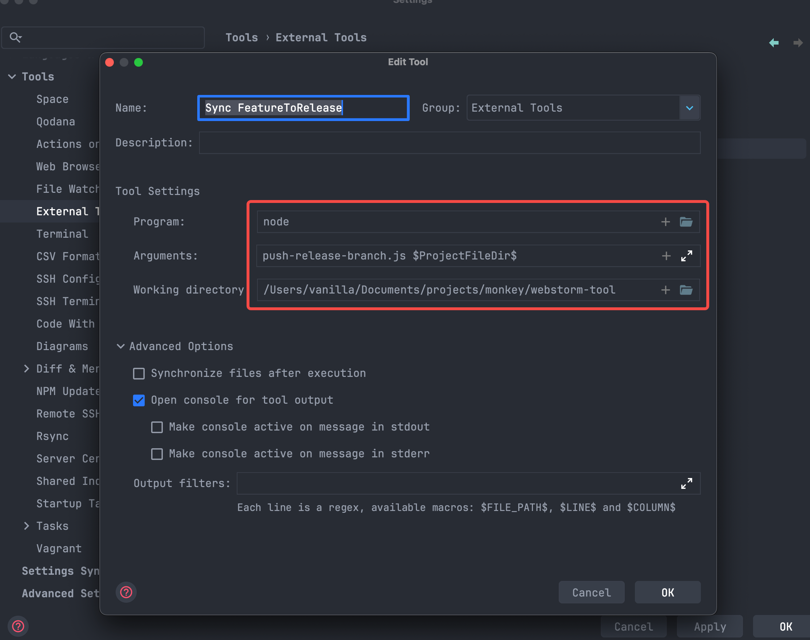
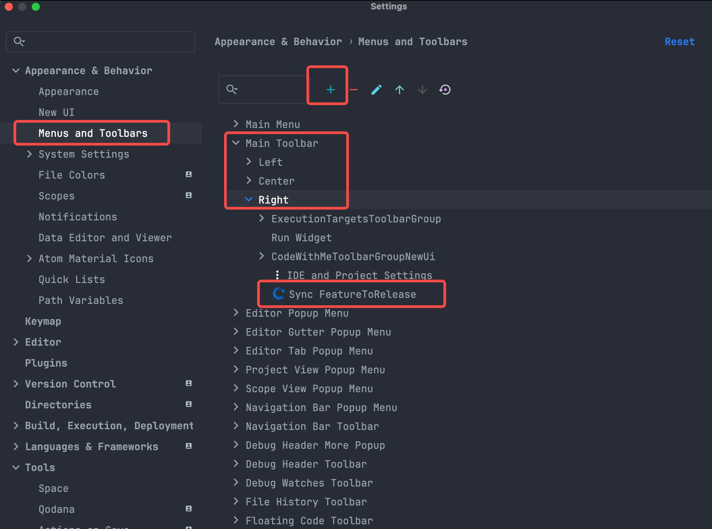
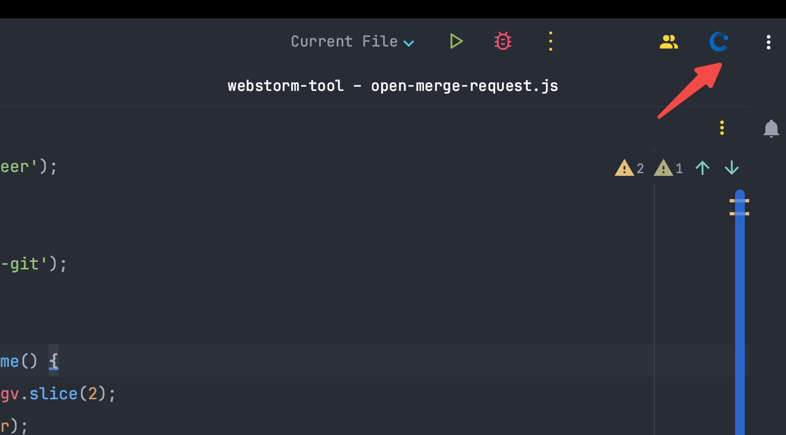

# webstorm-tool
记录使用 webstrom 中自己开发的提效工具

## sync-git-feature-to-release.js
日常工作开发中经常需要将本地的 feature/xxx 分支同步到 对应的 release/xxx 远端，一般操作是 切换到 release/xxx 分支后将 feature/xxx 合并过来再推送到远端。
操作比较麻烦还会影响本地工作区的代码，于是写了这个脚本，支持配置在 webstorm 中，点击一个按钮即可完成上述步骤。
效果视频可看 images/Screen Recording 2023-09-20.mov
配置步骤：
1. 新增一个 External Tool

2. 自定义工具栏

保存后，工具栏右边就出现了一个按钮：

点击就可以同步啦。

